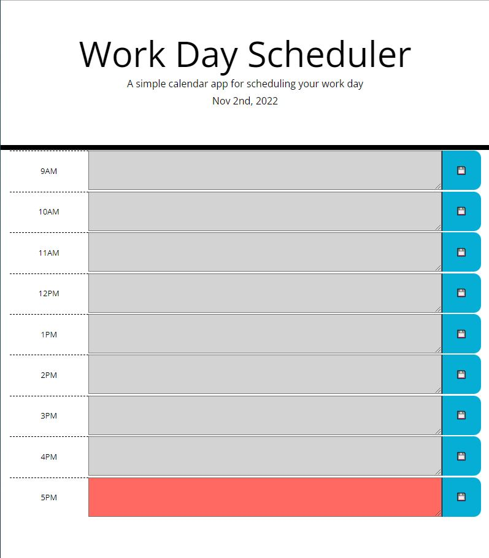
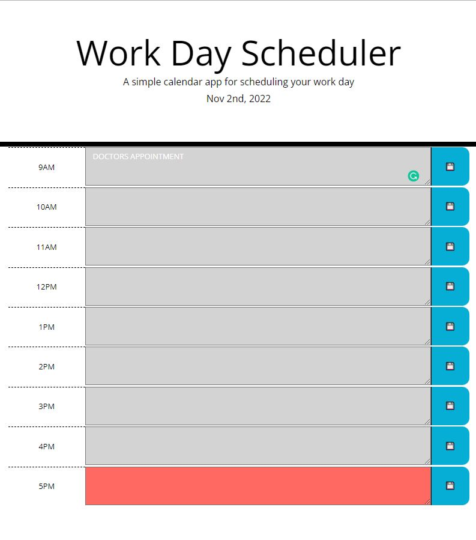
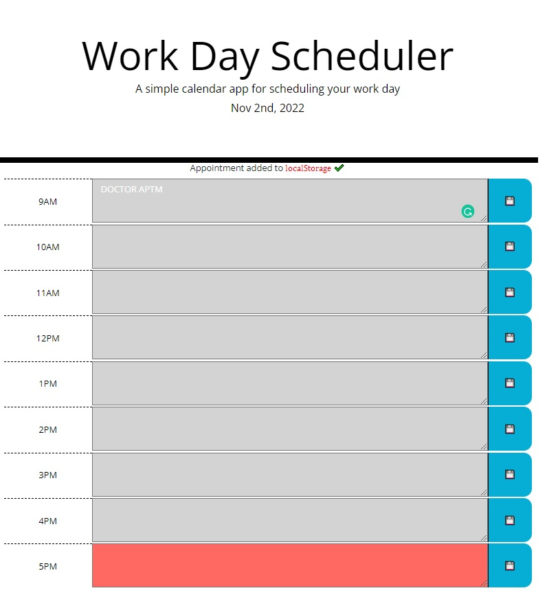

# Week #5 Challenge: Daily scheduler

## Description

This website has been created to help the user to keep a track of the daily acitivies.

## Installation

N/A

## Usage

To use this page the user just needs to click on the time block and type the information desired. then click on the Save button. when the information is saved it will dispaly a message on top of the time block saying that the information has been saved in the local storage. the information will remain as long as the local storage is not clear. Also the user will be a change of color depending on the time of the day. if the event is past, present or future time.

The deployment application link is https://gmontano79.github.io/dailycalendar/

### **Initial Page**

### **Input information**

### **Saved confirmation**

## Credits

N/A

## License

Please refer to the LICENSE in the repo.
